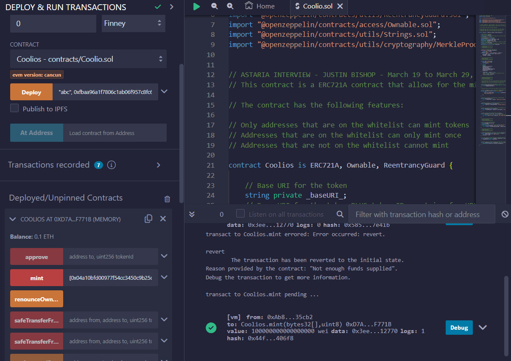
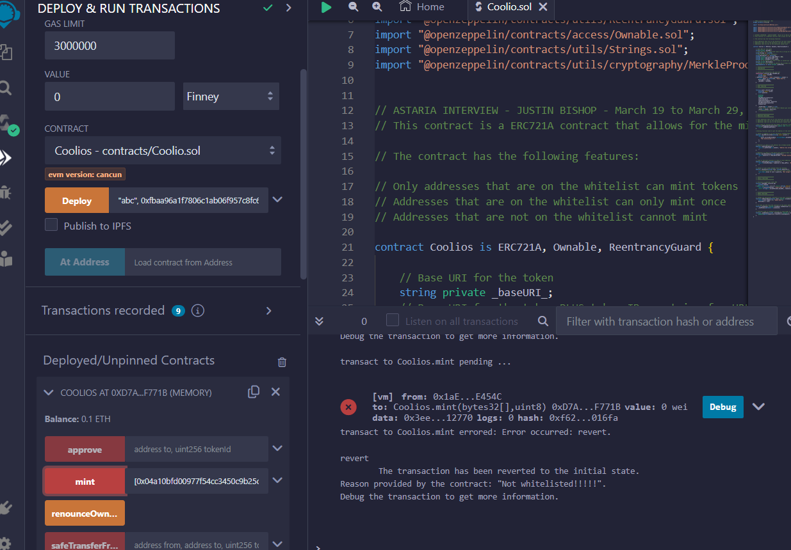
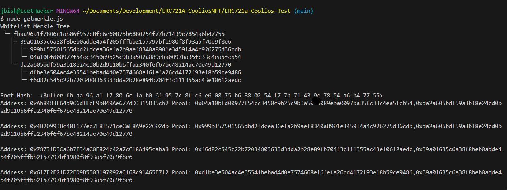
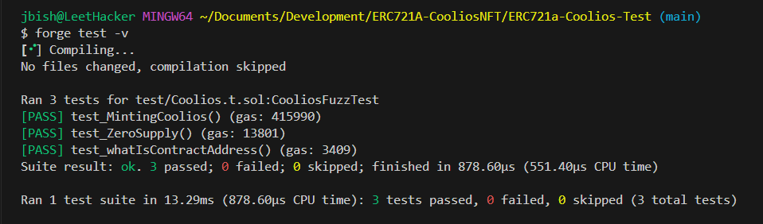
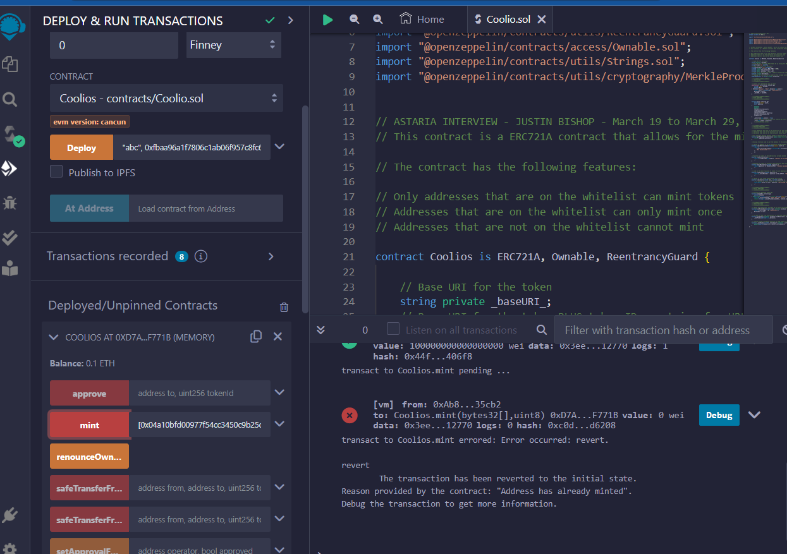

# ERC721A NFT Whitelist Mint Project
Justin Bishop
March 29, 2024

The purpose of this project is to build an ERC721A NFT Whitelist project that only allows addresses on the Whitelist to mint NFT tokens. The project uses Solidity and Foundry for the tests.

## Key Features
Addresses must be whitelisted to mint  
Addresses can not mint 2x  
Not Whitelisted Addresses can not mint  

## What is a Merkle Tree?  
The first problem to figure out was "How do I make a whitelist??". For the first 3 days of thinking about this project, I just consumed content on the internet, watched videos and read articles.

I found the Merkle Tree. Since writing data into contracts is expensive, a Merkle Tree allows us to hash our whitelist addresses into one single merkle root hash. We then use this root to deploy the contract. We tell the constructor that this contract is initialized with these specific addresses which we use later in the mint funciton with the "Proofs" that we generated.

We know that if the user is trying to mint from an address that is not on our whitelist, they will be able to get any proofs that will match the merkle roots that was passed into the constructor. Therfore, addresses not in our whitelist will NOT be able to mint.

## How the mint works
ERC721A is known for gas optimization when minting multiple NFTs at once compared to the more expensive ERC721. This is because ERC721A updates the owner information only when the NEXT owner mints tokens further down in the mint array.

When the second owner mints, we know that the previous 0x slots must be from buyer 1. This 0x empty slot usage saves on write minting gas fees when minting multiple NFT's

There is a trade off though. We save on gas when we mint, but the seller will end up paying full gas if they sell later on. I guess this would be good for NFT projects where you are not sure if it will take off. So you can save costs for your community members who buy your NFT's

Here you can see the mint confirmed.  

Here you can see the mint fails due to address not whitelisted.

## Running getmerkle.js
Run with node
- node install merkletreejs keccak256
- node getmerkle.js

## Running Tests
install foundry  
https://book.getfoundry.sh/getting-started/installation  
open bash terminal  
forge test -vvv  

# Conclusion
This was a very abstract project for me as I have never seen any of this before. I knew of the basics in Solidity but have never worked with contracts or testing for that matter. And also I had never heard of SHA256 hashing or merkle binary trees.

Here is one last picture of the mint reverting due to "address has already minted"  

# Sources
Stack Exchange (Ethereum)  
Youtube  
Remix  
ERC721A (github)  
ERC721 (github)  
Solidty by Example  
chatGPT  
Google
